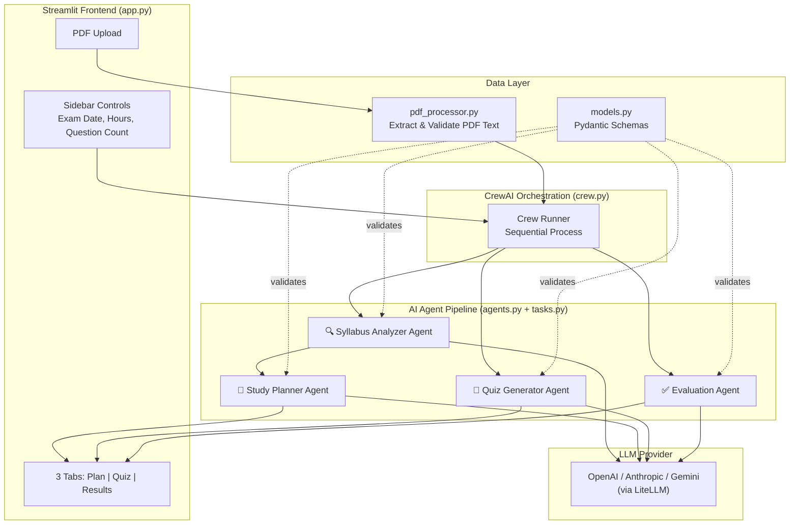
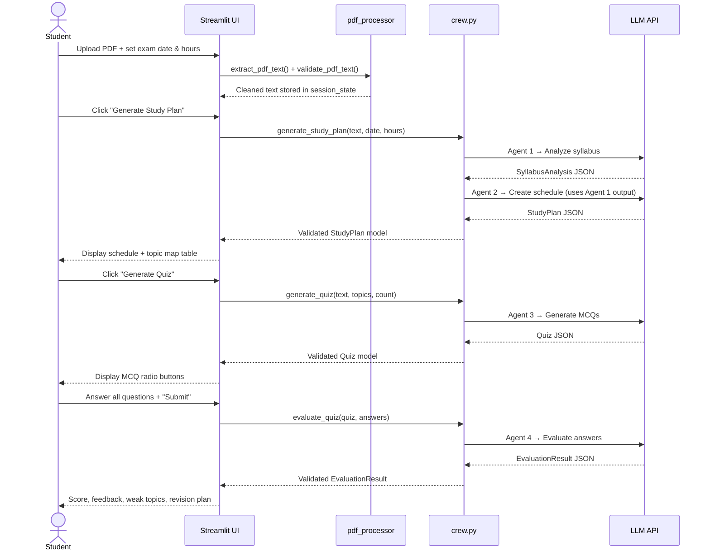
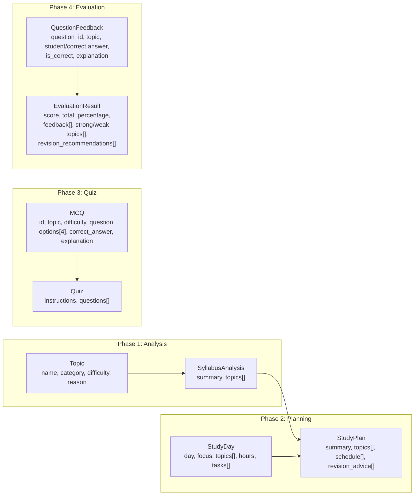

# StudyPilot AI — Complete Architecture & Workflow Breakdown

## What It Is

StudyPilot AI is a **multi-agent AI study assistant** built with **CrewAI + Streamlit**. A student uploads a PDF syllabus, and a pipeline of 4 specialized AI agents collaboratively produces a personalized study plan, quiz, and revision recommendations.

---

## High-Level Architecture

---

## File-by-File Breakdown

| File | Role | Lines | Key Responsibility |
|------|------|-------|--------------------|
| [app.py](file:///c:/Users/Naynika/OneDrive/Documents/StudyPilot%20AI/app.py) | **UI & main entrypoint** | 558 | Streamlit interface, session state, renders all views |
| [agents.py](file:///c:/Users/Naynika/OneDrive/Documents/StudyPilot%20AI/agents.py) | **Agent definitions** | 77 | Defines 4 CrewAI agents with roles/goals/backstories |
| [tasks.py](file:///c:/Users/Naynika/OneDrive/Documents/StudyPilot%20AI/tasks.py) | **Task prompts** | 131 | Crafts the detailed LLM prompts for each agent |
| [crew.py](file:///c:/Users/Naynika/OneDrive/Documents/StudyPilot%20AI/crew.py) | **Orchestration layer** | 81 | Runs CrewAI crews, validates output into Pydantic models |
| [models.py](file:///c:/Users/Naynika/OneDrive/Documents/StudyPilot%20AI/models.py) | **Data contracts** | 89 | Pydantic schemas for all structured AI output |
| [pdf_processor.py](file:///c:/Users/Naynika/OneDrive/Documents/StudyPilot%20AI/pdf_processor.py) | **PDF ingestion** | 43 | Extracts text via `pypdf`, validates usability |
| [requirements.txt](file:///c:/Users/Naynika/OneDrive/Documents/StudyPilot%20AI/requirements.txt) | **Dependencies** | 6 | crewai, streamlit, pypdf, pydantic, python-dotenv |
| [.env.example](file:///c:/Users/Naynika/OneDrive/Documents/StudyPilot%20AI/.env.example) | **Config template** | 13 | API key + model name for OpenAI/Anthropic/Gemini |

---

## The 4-Agent Pipeline

This is the core of the project. Each agent is a specialist with one job:

### Agent 1: 🔍 Syllabus Analyzer

| Property | Value |
|----------|-------|
| **Defined in** | [agents.py:L11-25](file:///c:/Users/Naynika/OneDrive/Documents/StudyPilot%20AI/agents.py#L11-L25) |
| **Task prompt** | [tasks.py:L21-43](file:///c:/Users/Naynika/OneDrive/Documents/StudyPilot%20AI/tasks.py#L21-L43) |
| **Input** | Raw PDF text (truncated to 18k chars) |
| **Output** | `SyllabusAnalysis` → summary + list of `Topic` objects (name, category, difficulty, reason) |
| **Purpose** | Reads the PDF like a teacher preparing a course map — extracts topics, categorizes them, and assigns Easy/Medium/Hard difficulty |

### Agent 2: 📅 Study Planner

| Property | Value |
|----------|-------|
| **Defined in** | [agents.py:L28-42](file:///c:/Users/Naynika/OneDrive/Documents/StudyPilot%20AI/agents.py#L28-L42) |
| **Task prompt** | [tasks.py:L46-73](file:///c:/Users/Naynika/OneDrive/Documents/StudyPilot%20AI/tasks.py#L46-L73) |
| **Input** | Output of Agent 1 (via `context=[analysis_task]`) + exam date + hours/day |
| **Output** | `StudyPlan` → summary, topics, daily schedule (`StudyDay[]`), revision advice |
| **Purpose** | Creates a realistic day-by-day schedule, prioritizing hard topics earlier and balancing workload |

> [!IMPORTANT]
> Agents 1 & 2 run together as a **single sequential crew** — the planner automatically receives the analyzer's output via CrewAI's `context` mechanism.

### Agent 3: 📝 Quiz Generator

| Property | Value |
|----------|-------|
| **Defined in** | [agents.py:L45-59](file:///c:/Users/Naynika/OneDrive/Documents/StudyPilot%20AI/agents.py#L45-L59) |
| **Task prompt** | [tasks.py:L76-102](file:///c:/Users/Naynika/OneDrive/Documents/StudyPilot%20AI/tasks.py#L76-L102) |
| **Input** | PDF text + topic list from the study plan + desired question count |
| **Output** | `Quiz` → instructions + list of `MCQ` objects (4 options each, validated) |
| **Purpose** | Generates MCQs **strictly** from the uploaded material — never hallucinates questions outside the PDF |

### Agent 4: ✅ Evaluation Agent

| Property | Value |
|----------|-------|
| **Defined in** | [agents.py:L62-76](file:///c:/Users/Naynika/OneDrive/Documents/StudyPilot%20AI/agents.py#L62-L76) |
| **Task prompt** | [tasks.py:L105-130](file:///c:/Users/Naynika/OneDrive/Documents/StudyPilot%20AI/tasks.py#L105-L130) |
| **Input** | Full quiz JSON + student's answer selections |
| **Output** | `EvaluationResult` → score, percentage, per-question feedback, strong/weak topics, revision recommendations |
| **Purpose** | Turns quiz results into **actionable learning guidance** |

---

## End-to-End User Workflow

---

## Data Flow & Pydantic Models

All AI output is validated through strict Pydantic schemas in [models.py](file:///c:/Users/Naynika/OneDrive/Documents/StudyPilot%20AI/models.py):

> [!NOTE]
> The `MCQ` model has **3 validators**: exactly 4 options, non-empty correct answer, and the correct answer must match one of the options exactly. This prevents broken quiz questions from reaching the UI.

---

## Tech Stack

| Layer | Technology | Purpose |
|-------|------------|---------|
| **Frontend** | Streamlit 1.37 | Web UI with custom CSS theming |
| **Agent Framework** | CrewAI 1.14.5 | Multi-agent orchestration |
| **LLM Routing** | LiteLLM (bundled in CrewAI) | Swap between OpenAI/Anthropic/Gemini via env var |
| **PDF Parsing** | pypdf 4.3.1 | Text-based PDF extraction |
| **Data Validation** | Pydantic ≥2.8 | Structured output contracts |
| **Config** | python-dotenv | API keys from `.env` file |

---

## Key Design Decisions

| Decision | Rationale |
|----------|-----------|
| **Sequential process** ([crew.py:L45](file:///c:/Users/Naynika/OneDrive/Documents/StudyPilot%20AI/crew.py#L45)) | Each agent depends on the previous one's output — simpler and safer than parallel |
| **`allow_delegation=False`** ([agents.py:L24](file:///c:/Users/Naynika/OneDrive/Documents/StudyPilot%20AI/agents.py#L24)) | Prevents agents from spawning sub-workflows — keeps V1 predictable |
| **18k char truncation** ([tasks.py:L15](file:///c:/Users/Naynika/OneDrive/Documents/StudyPilot%20AI/tasks.py#L15)) | Avoids LLM context window limits and keeps costs manageable |
| **No database** | Stateless via Streamlit `session_state` — keeps the project beginner-friendly |
| **No OCR** | Only text-based PDFs supported — avoids Tesseract complexity in V1 |
| **Flexible LLM provider** ([.env.example](file:///c:/Users/Naynika/OneDrive/Documents/StudyPilot%20AI/.env.example)) | Single `LLM_MODEL` env var switches between GPT-4o-mini, Claude, Gemini |

---

## UI Structure

The Streamlit app ([app.py](file:///c:/Users/Naynika/OneDrive/Documents/StudyPilot%20AI/app.py)) is organized into:

- **Hero section** — branded header with gradient background
- **Sidebar** — PDF upload, exam date, study hours, question count
- **Status bar** — 4 metrics (Material / Plan / Quiz / Review status)
- **3 tabs**:
  - **Plan** — `render_study_plan()` shows daily schedule + topic map table
  - **Quiz** — `render_quiz()` shows MCQs with radio buttons
  - **Results** — `render_evaluation()` shows score, feedback, strong/weak topics, revision advice
- **Custom CSS theme** — lavender/blue palette with glassmorphic cards, badges, and gradient progress bars

---

## What's Not In V1

The project explicitly calls out these as out-of-scope:

- No persistent database or user accounts
- No OCR for scanned PDFs
- No model training or GANs
- No parallel agent execution
- No agent delegation/sub-workflows
